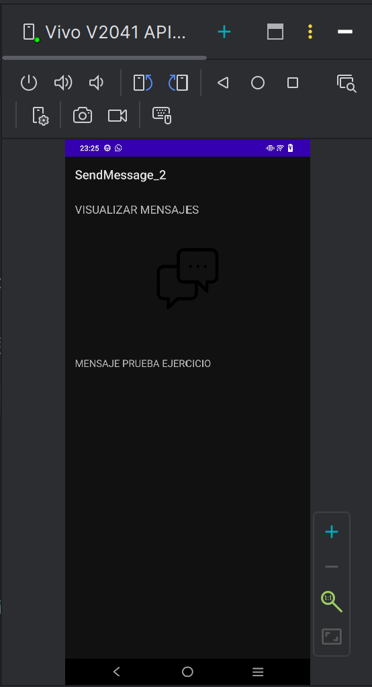
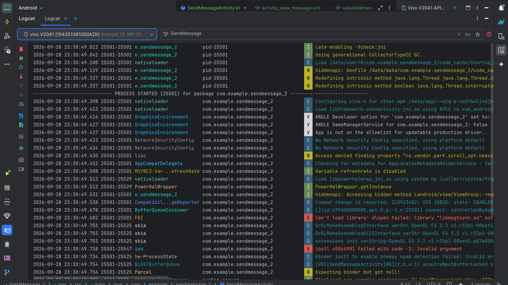

# Aplicación SendMessage - Comunicación entre Actividades en Android con Kotlin

Aplicación Android nativa desarrollada en Kotlin que demuestra el intercambio seguro de información entre actividades utilizando objetos parcelables (`Parcelable`), `Bundle` e `IntentCompat`. Permite redactar un mensaje en una primera pantalla y visualizarlo detalladamente en una segunda pantalla con información completa del remitente y destinatario.

---

## 📱 Muestrario Visual

| Redacción del mensaje | Visualización del mensaje | Registros de Logcat |
| :---: | :---: | :---: |
|  |  |  |

---

## ✨ Descripción y Características

- **Envío de mensajes estructurados**: Creación y transmisión del objeto `Message` conteniendo detalles del mensaje, así como objetos embebidos de tipo `Person` (remitente y destinatario).
- **Serialización eficiente con `@Parcelize`**: Utilización del plugin de Kotlin Parcelize para optimizar el paso de objetos entre componentes de Android.
- **Transmisión de datos compatible (Android 13+)**: Uso de `IntentCompat.getParcelableExtra` para asegurar compatibilidad retroactiva y cumplimiento con las API modernas de Android.
- **Rastreo completo del ciclo de vida**: Control y depuración detallada de cada estado de las actividades (`onCreate`, `onStart`, `onResume`, `onPause`, `onStop`, `onDestroy`) mediante logs personalizados en `Logcat`.
- **Generación de documentación técnica**: Integración con Dokka para compilar la documentación KDoc del código en formatos HTML y Javadoc.

---

## 🛠️ Arquitectura y Tecnologías

- **Lenguaje**: [Kotlin](https://kotlinlang.org/) (JVM Target 17)
- **Componentes Android UI**:
    - Views / Layouts XML (`ConstraintLayout`, `Material Design`)
    - `AppCompatActivity` y `ViewBinding`
- **Paso de Datos y Estado**:
    - `Intent` y `Bundle`
    - `Parcelable` mediante `@Parcelize`
    - `IntentCompat`
- **Herramientas de construcción y documentación**:
    - Gradle (Kotlin DSL)
    - [Dokka](https://github.com/Kotlin/dokka) para generación de documentación KDoc en `/documentation/html` y `/documentation/javadoc`.
- **Nivel de SDK**:
    - `minSdk`: 24 (Android 7.0 Nougat)
    - `targetSdk`: 35 (Android 15)
    - `compileSdk`: 35

---

## 🚀 Comenzando

### Prerrequisitos
- **Android Studio**: Android Studio Jellyfish / Ladybug (2024.1.1 o superior recomendado).
- **JDK**: Java Development Kit 17.
- **Dispositivo o Emulador**: Android 7.0 (API 24) o superior.

### Instalación y Ejecución
1. **Clonar el repositorio**:
   ```bash
   git clone https://github.com/usuario/SendMessage_2.git
   cd SendMessage_2
   ```
2. **Abrir en Android Studio**:
    - Inicia Android Studio y selecciona `Open`.
    - Navega a la carpeta del proyecto y haz clic en `OK`.
3. **Sincronizar Gradle**:
    - Deja que Gradle descargue e instale todas las dependencias indicadas en `build.gradle.kts`.
4. **Ejecutar la aplicación**:
    - Selecciona tu dispositivo de pruebas (emulador o físico con depuración USB habilitada).
    - Presiona `Run` (`Shift + F10`).

---

## 📐 Estructura del Proyecto

```
app/src/main/java/com/example/sendmessage_2/
├── model/
│   ├── Message.kt         # Clase Parcelable que representa el mensaje
│   └── Person.kt          # Clase Parcelable con información del usuario
├── SendMessageActivity.kt # Actividad principal para redactar y enviar mensajes
└── ViewMessageActivity.kt # Actividad secundaria para mostrar el mensaje recibido
```

- **`SendMessageActivity`**: Pantalla principal con un campo `EditText` para escribir el mensaje y un `Button` que construye la instancia de `Message` y la envía mediante un `Intent`.
- **`ViewMessageActivity`**: Pantalla secundaria que extrae el objeto `Message` con `IntentCompat` y despliega la información del remitente y contenido en un `TextView`.

---

## 🔍 Proceso de Depuración

Se han configurado registros de trazabilidad mediante `Logcat` en ambas actividades (`SendMessageActivity` y `ViewMessageActivity`) etiquetando eventos clave del ciclo de vida (`onCreate`, `onStart`, `onResume`, `onPause`, `onStop`, `onDestroy`). Esto permite verificar el comportamiento de la aplicación en transiciones de pantalla o cambios de configuración.

---

## 🔗 Enlaces de Interés

- [Documentación oficial de Android Developers](https://developer.android.com)
- [Guía de Intents y Filtros en Android](https://developer.android.com/guide/components/intents-filters?hl=es-419)
- [Guía de Parcelable en Kotlin](https://developer.android.com/kotlin/parcelize)
- [Documentación de Dokka](https://kotlinlang.org/docs/dokka-migration.html)


